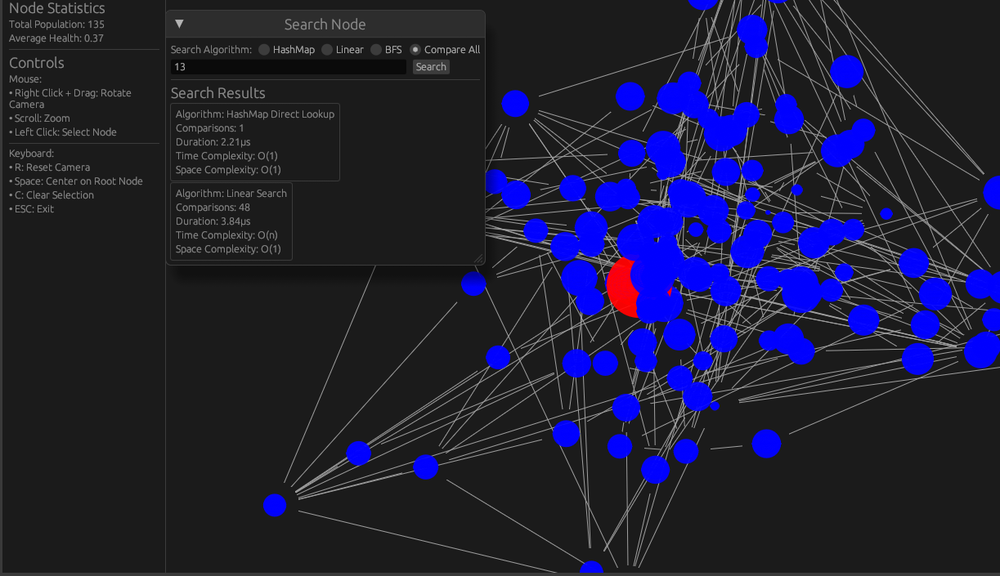

# SynapticWeb

> A representation of the earth as we know

<p align="start">
    
</p>

## Overview

SynapticWeb is a real-time 3D visualization system that simulates the growth and evolution of interconnected nodes in a self-organizing network. It demonstrates complex system behavior through the lens of node reproduction, and generational progression.

This is also a great system to demonstrate the use of different Data Structure Algorithms to find nodes in the system itself.

## Getting Started

To run SynapticWeb, run the following commands. This is a Rust application using `egui`.

```bash
git clone github.com/ThembinkosiThemba/synaptic-web
cd synaptic-web
cargo run
```

This will launch the application with a graphical interface where you can interact with the nodes, perform searches, and observe the network dynamics.

## Data Structures

### 1. **Node**

- **Description**: Represents an individual entity in the network.
- **Properties**:
  - `id`: Unique identifier for the node.
  - `position`: 3D position in space.
  - `velocity`: Movement vector.
  - `properties`: Contains attributes like color, size, strength, health, etc.
  - `parents`: Optional tuple of parent node IDs.

### 2. **NodeProperties**

- **Description**: Holds the attributes of a node.
- **Properties**:
  - `color`: RGB color representation.
  - `size`: Size of the node.
  - `strength`: Strength attribute.
  - `health`: Current health level.
  - `half_life`: Time until health is halved.
  - `breeding_attempts`: Number of breeding attempts.
  - `generation`: Generation number.

### 3. **SynapticWeb**

- **Description**: Manages the entire network of nodes.
- **Properties**:
  - `nodes`: HashMap storing nodes with their IDs as keys.
  - `next_id`: Counter for generating unique node IDs.
  - `camera`: Manages the 3D view.
  - `selected_node`: Currently selected node ID.
  - `last_breed_time`: Timestamp of the last breeding event.

### 4. **Camera**

- **Description**: Handles 3D navigation and view manipulation.
- **Properties**:
  - `position`: Camera's position in 3D space.
  - `rotation`: Camera's orientation.
  - `zoom`: Zoom level.

## Algorithms

### 1. **HashMap Direct Lookup**

- **Description**: Quickly retrieves a node using its ID.
- **Time Complexity**: O(1)
- **Space Complexity**: O(1)
- **Use Case**: Fast access when the node ID is known.

### 2. **Linear Search**

- **Description**: Iterates through all nodes to find a match.
- **Time Complexity**: O(n)
- **Space Complexity**: O(1)
- **Use Case**: Useful for small datasets or when HashMap is unavailable.

### 3. **Breadth-First Search (BFS)**

- **Description**: Explores nodes level by level, starting from the root.
- **Time Complexity**: O(V + E) where V is vertices and E is edges.
- **Space Complexity**: O(V)
- **Use Case**: Efficient for finding nodes by traversing relationships.

### 4. **Dijkstra's Shortest Path (DSP)**

- **Description**: Finds the shortest path between two nodes.
- **Time Complexity**: O((V + E) \* log V)
- **Space Complexity**: O(V)
- **Use Case**: Useful for pathfinding in weighted graphs.

## Real-World Adaptation and Use Cases

1. **Network Analysis**: SynapticWeb can be adapted to analyze and visualize complex networks such as social networks, biological networks, or computer networks.

2. **Simulation of Ecosystems**: The reproduction and health decay mechanisms can simulate real-world ecosystems, useful for educational purposes or research.

3. **Pathfinding and Navigation**: The search algorithms can be applied to robotics and AI for navigation and pathfinding tasks.

4. **Data Visualization**: The 3D visualization capabilities can be used to represent large datasets in an interactive manner, aiding in data analysis and decision-making.

## Conclusion

SynapticWeb is a versatile tool for simulating and visualizing complex networks. Its use of various data structures and algorithms provides a robust framework for exploring dynamic systems, making it applicable in numerous fields such as network analysis, ecosystem simulation, and data visualization.
